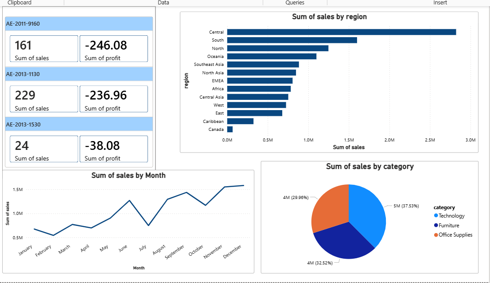

# Superstore Data Analysis 📊

## 📌 Project Overview
This project analyzes sales, profit, and customer trends using Python.

## 📊 Dashboard

## 🛠 Tools Used
- Python (Pandas, Matplotlib)
- Data Cleaning & Transformation
- Data Visualization

## 📈 Key Insights
- Central region has highest sales
- Technology category generates maximum revenue
- Sales increase towards year-end
- Some products are causing losses

## 📂 Dataset
- Superstore Sales Dataset

## 🚀 Project Type
Data Analytics | Intermediate Level
